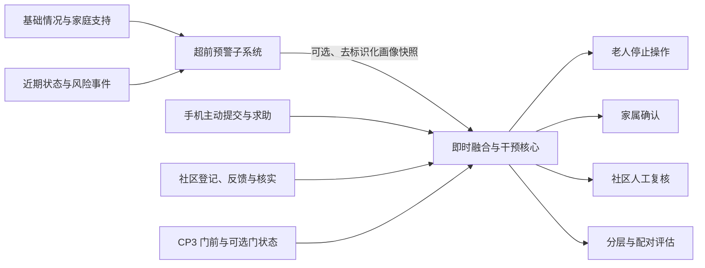

# 耄耋反诈智盾

我们正在建设一套面向居家养老与社区照护场景的老年人诈骗风险识别、即时提醒和反诈宣教系统。

项目以“**超前预警 + 即时情景预警**”为核心：既关注老人在诈骗接触发生前是否进入易受骗状态，也关注具体接触过程中是否出现索要验证码、要求转账、诱导安装、可疑链接、身份冒充和制造紧迫感等危险信号。

当前统一优先级、依赖和证据门禁见[项目计划](../PROJECT_PLAN.md)。

## 双阶段与三场景协同

- **超前预警子系统**：根据老人基本情况、家庭支持、信息暴露、既往经历和近期变化，形成长期易感画像、四级预警、原因解释和人工处置建议。
- **三类当前事件入口**：手机端优先采用转发、截图/粘贴和求助键；社区端优先采用人员/活动登记、居民反馈和人工核实；上门场景优先在业主自管区域接入 CP3 门前事件与可选门状态。
- **即时融合与个性化干预核心**：显式共同案例引用、多场景事件聚合、事件级证据门槛、回放、三端反馈、审计和画像回退已经进入主线；当前等待 Community 配套和生产部署验收。
- **对照验证**：对相同画像和情景比较无提示、通用提示与个性化提示，区分合成模拟结果、真人宣教测试和真实部署效果。

## 项目仓库

| 仓库 | 定位 | 当前工作 |
| --- | --- | --- |
| [`elderly-fraud-risk-system`](https://github.com/Silver-yiyangyiyang/elderly-fraud-risk-system) | 超前预警子系统 | 多维画像、动态近况、四级预警、解释建议和人工处置闭环 |
| [`mobile-fraud-guard`](https://github.com/Silver-yiyangyiyang/mobile-fraud-guard) | 手机电诈防护模块 | 主动提交、数据质检、实验模型、规则兜底、推理 API 和旁路影子模式已建立；未接真实手机权限，训练授权仍待核验 |
| [`community-fraud-guard`](https://github.com/Silver-yiyangyiyang/community-fraud-guard) | 社区诈骗核实模块 | 软件登记、居民反馈、人工核实和住户授权门前设备事件消费闭环已建立；没有公共区域设备，Silver 配套 PR 待修正 |
| [`home-visit-fraud-guard`](https://github.com/Silver-yiyangyiyang/home-visit-fraud-guard) | 陌生人上门与入户防护模块 | 授权门前音频、抓拍/行为证据、场景适配和 Silver 提交已进入主线；实体设备回调仍待验收 |
| [`fraud-guard-shared`](https://github.com/Silver-yiyangyiyang/fraud-guard-shared) | 跨场景共享模块 | 已提供 Home/Community 共用的门前 FLV AAC、16 kHz WAV、抓拍、ASR 和场景适配；不提供公共区域设备能力 |
| [`silver-fraud-guard`](https://github.com/Silver-yiyangyiyang/silver-fraud-guard) | 即时融合与干预核心 | 多事件聚合、事件证据门槛、回放、三端反馈、画像 v2 回退和受控离线迭代已进入主线；Community 配套和生产部署待完成 |
| [`fraud-guard-clients`](https://github.com/Silver-yiyangyiyang/fraud-guard-clients) | Web 与微信小程序 | 合成 MVP、共享契约、构建及 Silver 合成 HTTP 联调已合并；生产域名和微信真机待验收 |
| [`jbgs-proposal`](https://github.com/Silver-yiyangyiyang/jbgs-proposal) | 项目计划书 | 总体目标、数据路线、阶段清单、验证方案和成果边界 |

部分仓库为团队内部协作仓库，访问权限以组织设置为准。

## 我们识别什么

系统把下列内容记录为**诈骗者使用的心理操纵手段**，而不是对受害者的道德评价：

- **利益诱导**：保本高收益、限时名额、返利或中奖承诺
- **恐吓施压**：账户异常、涉嫌违法、家人遇险或必须立即处理
- **信任操纵**：冒充机构、熟人、专家、客服或长期建立依赖
- **同情与情感操纵**：亲友情感、孤独陪伴、紧急求助或健康关怀

心理操纵标签用于解释诈骗手段；高风险判断仍必须有当前情景证据，不能只凭年龄、独居、教育程度或其他画像因素认定老人正在受骗。

## 数据与验证边界

- 只在授权范围内使用数据，不公开 CHARLS、CHFS 等受限原始微观数据。
- 跨仓只交换最小化、去标识化、带版本号的画像快照、事件证据与评估结果。
- `advance-warning-profile-v2` 已实现授权门控、去标识化导出、有效期和场景字段最小化；即时系统已完成兼容、过期和缺失回退测试，但真实部署仍需单独验收。
- 手机端不默认后台读取短信或持续录音；Home 与 Community 都可按授权消费住户自管门前设备事件，Community 只接收最小化派生结果且没有公共区域设备。
- 不收集完成系统功能所不需要的姓名、身份证号、住址、联系方式或账户信息。
- 系统不自动转账、冻结账户、封号、报警或替老人作出决定。
- 合成案例和 AI 模拟只用于机制、流程与工程验证，不能表述为真实老人受骗率已经下降。
- 真人宣教测试必须取得知情同意，使用虚构机构和虚拟资金，并在结束后立即揭示模拟内容。

## 技术路线

- **后端与接口**：Python、FastAPI、Pydantic
- **数据与审计**：SQLite、版本化规则、可追溯评估记录
- **场景接入**：手机主动提交、社区登记/反馈、业主自管门前的萤石 CP3 消息回调与可选门状态事件
- **分析与验证**：可解释评分、分层指标、固定回归案例、配对模拟
- **交互演示**：面向老人、家属和社区的浏览器端演示流程

## 项目目标

我们希望把老年人反诈从单纯的事后处置，推进为：

1. 在诈骗接触前识别易受骗状态；
2. 在具体诈骗接触中识别危险证据；
3. 在损失发生前给出清晰、个性化且可执行的提示；
4. 通过老人、家属与社区协同完成核实和人工处置；
5. 用透明、可复现的实验检验系统机制，同时如实说明证据边界。

## 当前收口重点

1. 由 Community 负责人修正 PR #7 的门前设备消费边界和未核验提交门禁，再完成三场景融合收口；
2. 恢复安全服务器/设备访问，完成 Silver 远端部署和 Home 实体门前设备回调；
3. 核验 Mobile 训练授权、独立验证集与系统级电话/短信权限，失败时保持规则和主动提交回退；
4. 完成 Silver 生产 API 安全基线，以及 Web/小程序生产域名和微信真机验收；
5. 按同一版本锁定计划书、去敏提交包、答辩材料和平台回执，并严格区分模拟、真人和真实部署证据。
