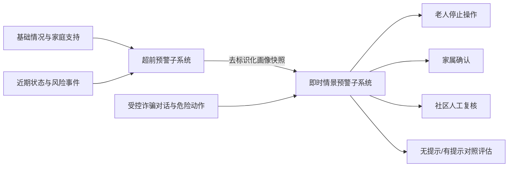

# 耄耋反诈智盾

我们正在建设一套面向居家养老与社区照护场景的老年人诈骗风险识别、即时提醒和反诈宣教系统。

项目以“**超前预警 + 即时情景预警**”为核心：既关注老人在诈骗接触发生前是否进入易受骗状态，也关注具体接触过程中是否出现索要验证码、要求转账、诱导安装、可疑链接、身份冒充和制造紧迫感等危险信号。

## 双系统协同

- **超前预警子系统**：根据老人基本情况、家庭支持、信息暴露、既往经历和近期变化，形成长期易感画像、四级预警、原因解释和人工处置建议。
- **即时情景预警与个性化干预子系统**：在模拟或受控的诈骗接触过程中识别诈骗手段与危险动作，并根据最小化画像调整提示表达、干预强度及联动对象。
- **对照验证**：对相同画像和情景比较无提示、通用提示与个性化提示，区分合成模拟结果、真人宣教测试和真实部署效果。

## 项目仓库

| 仓库 | 定位 | 当前工作 |
| --- | --- | --- |
| [`elderly-fraud-risk-system`](https://github.com/Silver-yiyangyiyang/elderly-fraud-risk-system) | 超前预警子系统 | 多维画像、动态近况、四级预警、解释建议和人工处置闭环 |
| [`silver-fraud-guard`](https://github.com/Silver-yiyangyiyang/silver-fraud-guard) | 即时情景预警与个性化干预子系统 | 受控多轮对话、心理操纵标签、危险动作识别、即时提示和配对模拟 |
| [`jbgs-proposal`](https://github.com/Silver-yiyangyiyang/jbgs-proposal) | 项目计划书 | 总体目标、数据路线、阶段清单、验证方案和成果边界 |

部分仓库为团队内部协作仓库，访问权限以组织设置为准。

## 我们识别什么

系统把下列内容记录为**诈骗者使用的心理操纵手段**，而不是对受害者的道德评价：

- **利益诱导**：保本高收益、限时名额、返利或中奖承诺
- **恐吓施压**：账户异常、涉嫌违法、家人遇险或必须立即处理
- **信任操纵**：冒充机构、熟人、专家、客服或长期建立依赖
- **同情与情感操纵**：亲友情感、孤独陪伴、紧急求助或健康关怀

心理操纵标签用于解释诈骗手段；高风险判断仍必须有当前情景证据，不能只凭年龄、独居、教育程度或其他画像因素认定老人正在受骗。

## 数据与验证边界

- 只在授权范围内使用数据，不公开 CHARLS、CHFS 等受限原始微观数据。
- 两套系统只交换最小化、去标识化、带版本号的画像快照与评估结果。
- 不收集完成系统功能所不需要的姓名、身份证号、住址、联系方式或账户信息。
- 系统不自动转账、冻结账户、封号、报警或替老人作出决定。
- 合成案例和 AI 模拟只用于机制、流程与工程验证，不能表述为真实老人受骗率已经下降。
- 真人宣教测试必须取得知情同意，使用虚构机构和虚拟资金，并在结束后立即揭示模拟内容。

## 技术路线

- **后端与接口**：Python、FastAPI、Pydantic
- **数据与审计**：SQLite、版本化规则、可追溯评估记录
- **分析与验证**：可解释评分、分层指标、固定回归案例、配对模拟
- **交互演示**：面向老人、家属和社区的浏览器端演示流程

## 项目目标

我们希望把老年人反诈从单纯的事后处置，推进为：

1. 在诈骗接触前识别易受骗状态；
2. 在具体诈骗接触中识别危险证据；
3. 在损失发生前给出清晰、个性化且可执行的提示；
4. 通过老人、家属与社区协同完成核实和人工处置；
5. 用透明、可复现的实验检验系统机制，同时如实说明证据边界。
